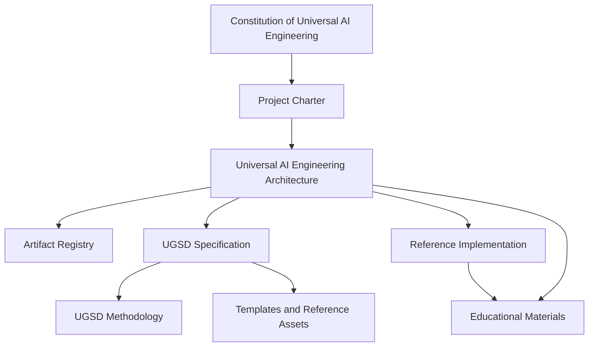

# Universal AI Engineering Architecture

```yaml
artifact_id: UAEA
artifact_type: Architecture
version: 0.1.0
status: Draft
parent: UAE-CHARTER
depends_on:
  - UAE-CONSTITUTION
  - UAE-CHARTER
```

## 1. Purpose

Universal AI Engineering Architecture (UAEA) defines the structural architecture of the Universal AI Engineering ecosystem: layers, artifacts, authority boundaries, dependencies, repositories, compatibility rules, and evolution model.

## 2. Architectural Context

Universal AI Engineering is a documentation-first engineering framework for AI-first software systems. It separates governance, architecture, standards, methodology, reference assets, reference implementation, and education so each artifact has a clear authority level and responsibility.

## 3. Architectural Principles

- Architecture precedes specification.
- Specification precedes implementation.
- Evidence supports acceptance.
- Human accountability remains explicit.
- Vendor independence is preserved.
- Lower-level artifacts do not redefine higher-level artifacts.
- Existing governed knowledge is consolidated rather than discarded when compatible with the governing hierarchy.

## 4. Ecosystem Model

```text
+------------------------------------------------+
| Governance                                     |
| Constitution, Project Charter                  |
+------------------------+-----------------------+
                         |
                         v
+------------------------------------------------+
| Architecture                                   |
| UAEA, ADRs, Artifact Registry                  |
+------------------------+-----------------------+
                         |
                         v
+------------------------------------------------+
| Standards                                      |
| UGSD Specification                             |
+------------------------+-----------------------+
                         |
                         v
+------------------------------------------------+
| Methodology                                    |
| UGSD Methodology                               |
+------------------------+-----------------------+
                         |
                         v
+------------------------------------------------+
| Reference Assets                               |
| Templates, schemas, checks, examples           |
+------------------------+-----------------------+
                         |
                         v
+------------------------------------------------+
| Reference Implementation                       |
| Universal Agentic OS                           |
+------------------------+-----------------------+
                         |
                         v
+------------------------------------------------+
| Education                                      |
| Senior AI Agent Engineer Handbook              |
+------------------------------------------------+
```

## 5. Ecosystem Layers

1. Governance
2. Architecture
3. Standards
4. Methodology
5. Reference Assets
6. Reference Implementation
7. Education

## 6. Artifact Authority Model

- The Constitution defines enduring rules.
- The Charter defines project intent, scope, and success.
- UAEA defines ecosystem structure and boundaries.
- Specifications define normative requirements.
- Methodology explains practical application.
- Reference assets encode reusable compliant patterns.
- Implementations demonstrate conformance.
- Educational material teaches and critiques the system.

No lower layer may silently redefine a higher layer.

## 7. Core Artifacts

| Artifact | Layer | Normative? | Primary responsibility |
| --- | --- | ---: | --- |
| Constitution | Governance | Yes | Enduring principles and authority |
| Project Charter | Governance | Yes | Scope, objectives, success |
| UAEA | Architecture | Yes | Structure and dependencies |
| Artifact Registry | Architecture | Yes for metadata | Central artifact index |
| UGSD Specification | Standards | Yes | Lifecycle and conformance |
| UGSD Methodology | Methodology | No, explanatory | Practical guidance |
| Reference Repository | Assets | Mixed | Templates and automation |
| Universal Agentic OS | Implementation | No | Reference conformance |
| Senior Handbook | Education | No | Senior-level application |

## 8. Artifact Dependency Model

Every governed artifact declares its `parent` and `depends_on` relationships and is indexed in the [Artifact Registry](../registry/Artifact-Registry.md). Machine-readable metadata remains in [registry/artifacts.yaml](../registry/artifacts.yaml) for validation and automation.

## 9. Normative Hierarchy



## 10. Governance Layer

The Governance Layer contains the [Constitution](../constitution/Constitution.md) and [Project Charter](../charter/Project-Charter.md).

## 11. Architecture Layer

The Architecture Layer contains UAEA, architectural decision records, diagrams, and the Artifact Registry.

## 12. Standards Layer

The Standards Layer contains normative specifications, beginning with the [UGSD Specification](../standards/UGSD-Specification.md).

## 13. Methodology Layer

The Methodology Layer explains how to apply approved standards. It does not redefine normative requirements.

## 14. Reference Assets Layer

The Reference Assets Layer will contain templates, schemas, checks, examples, and other reusable assets.

## 15. Implementation Layer

The Implementation Layer will contain Universal Agentic OS as a reference implementation. Implementations must identify supported specification versions.

## 16. Education Layer

The Education Layer will contain educational material such as the Senior AI Agent Engineer Handbook. Educational artifacts may depend on implementations for examples but remain governed by architecture and applicable specifications.

## 17. Repository Architecture

Initial monorepo structure:

```text
universal-ai-engineering/
|-- README.md
|-- CHANGELOG.md
|-- ROADMAP.md
|-- AGENTS.md
|-- constitution/
|-- charter/
|-- architecture/
|   |-- decisions/
|   `-- diagrams/
|-- registry/
|   `-- artifacts/
|-- standards/
|-- methodology/
|-- reference/
|-- agentic-os/
`-- senior-handbook/
```

The architecture permits later extraction into independent repositories when ownership, release cadence, or contribution volume justifies it.

## 18. Dependency Rules

1. Every artifact declares `parent` and `depends_on`.
2. Cyclic normative dependencies are prohibited.
3. Educational artifacts may depend on implementations and standards.
4. Standards must not depend on one reference implementation.
5. Reference implementations must identify supported specification versions.
6. Registry metadata must be machine-readable and reviewable.

## 19. Versioning Model

Semantic Versioning is used where practical:

- `MAJOR`: incompatible normative or structural change;
- `MINOR`: backward-compatible capability or requirement addition;
- `PATCH`: clarification or correction without intended behavioral incompatibility.

Draft status indicates that an artifact is not approved or stable. Compatibility is explicit, not inferred solely from matching major versions.

## 20. Lifecycle Model

```text
Planned -> Draft -> Review -> Approved -> Stable
                                   |
                                   v
                              Deprecated -> Retired
```

`Approved` means formally accepted but not necessarily released as a stable baseline. `Stable` means released and intended for supported use. Only Approved or Stable artifacts normally become Deprecated. Retired artifacts remain traceable but are no longer active.

## 21. Traceability Model

Traceability is maintained through metadata blocks, the human-readable registry, the machine-readable registry, internal links, changelog entries, and architectural decision records.

## 22. Change Governance

Material architecture changes require:

- proposal;
- impact analysis;
- ADR;
- affected-artifact list;
- migration and compatibility assessment;
- approval;
- registry update;
- verification.

## 23. AI Integration Architecture

AI systems implement capabilities and roles. Normative documents refer to abstract roles such as planner, analyst, architect, implementer, reviewer, evaluator, release assistant, and documentation assistant.

Products may implement these roles, but no product is embedded as a mandatory dependency.

## 24. Architectural Decision Records

Architectural Decision Records capture material architecture decisions and their consequences. Existing ADRs must be preserved unless explicit architectural approval authorizes retirement.

## 25. Architectural Invariants

- governing authority is explicit;
- implementation cannot redefine architecture;
- standards remain implementation-independent;
- evidence is required for acceptance;
- every artifact is registered;
- change history is preserved;
- human accountability remains identifiable.

## 26. Foundation Architecture Baseline

The proposed foundation baseline consists of the Constitution, Project Charter, UAEA, Artifact Registry, and UGSD Specification skeleton. Final acceptance requires explicit human approval.

## 27. Evolution Policy

Material architectural changes require impact analysis, registry synchronization, review, and explicit human approval.

## 28. Open Architectural Questions

- Exact ADR template.
- Registry machine-readable schema validation.
- Normative keyword conventions.
- Conformance profile model.
- Documentation build and publication process.
