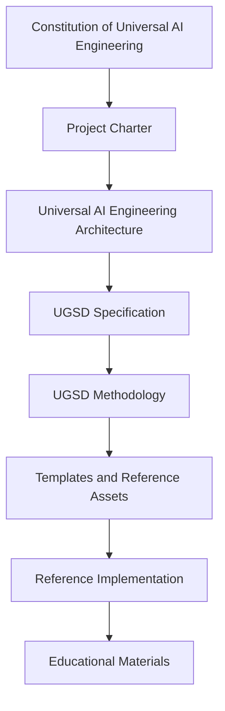

# Universal AI Engineering Architecture

```yaml
artifact_id: UAEA
artifact_type: Architecture
version: 0.1.0
status: Draft
parent: UAE-CHARTER
depends_on:
  - UAE-CONSTITUTION
  - UAE-CHARTER
```

## 1. Purpose

Universal AI Engineering Architecture (UAEA) defines ecosystem structure, artifact placement, dependency rules, authority boundaries, and evolution policy.

## 2. Architectural Context

UAE is a documentation-first engineering framework for AI-first systems. It separates governing authority, standards, explanatory methodology, reusable assets, implementation, and education.

## 3. Architectural Principles

- Architecture precedes specification.
- Specification precedes implementation.
- Evidence supports acceptance.
- Human accountability remains explicit.
- Vendor independence is preserved.
- Lower-level artifacts do not redefine higher-level artifacts.

## 4. Ecosystem Layers

1. Governance
2. Architecture
3. Standards
4. Methodology
5. Reference Assets
6. Reference Implementation
7. Education

## 5. Artifact Dependency Model

Every governed artifact has a stable ID, parent, dependencies, owner, status, version, lifecycle phase, and repository location recorded in the [Artifact Registry](../registry/Artifact-Registry.md).

## 6. Normative Hierarchy



## 7. Governance Layer

The Governance Layer contains the [Constitution](../constitution/Constitution.md) and [Project Charter](../charter/Project-Charter.md).

## 8. Architecture Layer

The Architecture Layer contains UAEA, architectural decision records, diagrams, and the Artifact Registry.

## 9. Standards Layer

The Standards Layer contains normative specifications, beginning with the [UGSD Specification](../standards/UGSD-Specification.md).

## 10. Methodology Layer

The Methodology Layer explains how to apply approved standards. It does not redefine normative requirements.

## 11. Reference Assets Layer

The Reference Assets Layer will contain templates, schemas, checks, examples, and other reusable assets.

## 12. Implementation Layer

The Implementation Layer will contain Universal Agentic OS as a reference implementation.

## 13. Education Layer

The Education Layer will contain educational material such as the Senior AI Agent Engineer Handbook.

## 14. Repository Architecture

The initial repository is organized by ecosystem layer:

```text
constitution/
charter/
architecture/
registry/
standards/
methodology/
reference/
agentic-os/
senior-handbook/
```

## 15. Versioning

Foundation artifacts use semantic versioning. Draft status indicates that an artifact is not approved or stable.

## 16. Traceability

Traceability is maintained through metadata blocks, the Artifact Registry, internal links, changelog entries, and architectural decision records.

## 17. Architectural Decision Records

Architectural Decision Records capture material architecture decisions and their consequences. The ADR directory is planned in [architecture/decisions](decisions/README.md).

## 18. Evolution Policy

Material architectural changes require impact analysis, registry updates, review, and explicit human approval.

## 19. Foundation Architecture Baseline

The initial foundation baseline consists of the Constitution, Project Charter, UAEA, Artifact Registry, and UGSD Specification skeleton.

## 20. Open Questions

- Exact ADR template.
- Registry machine-readable schema.
- Conformance profile model.
- Documentation publication process.
